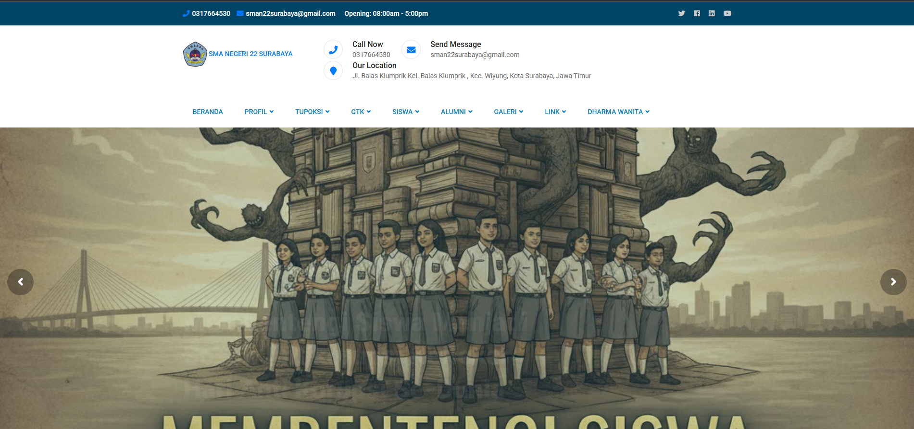
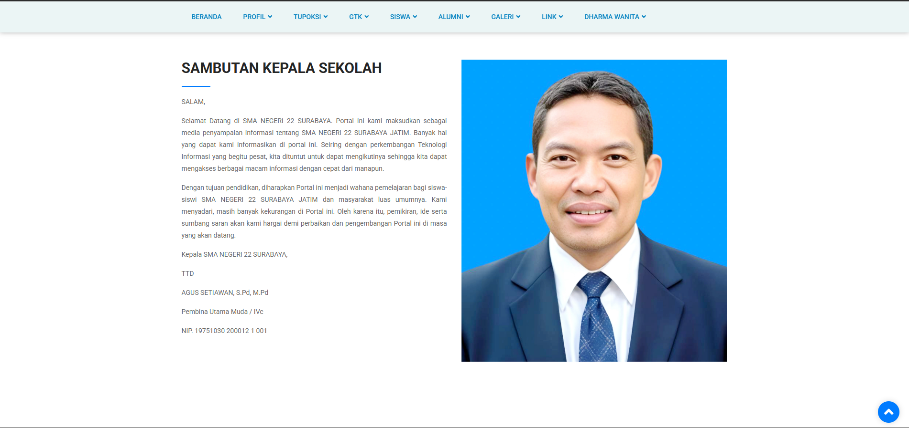
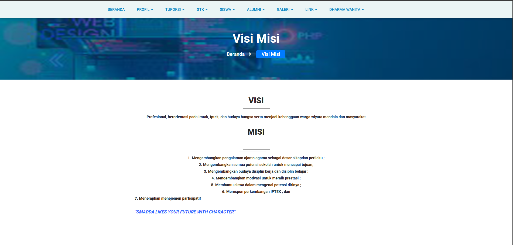
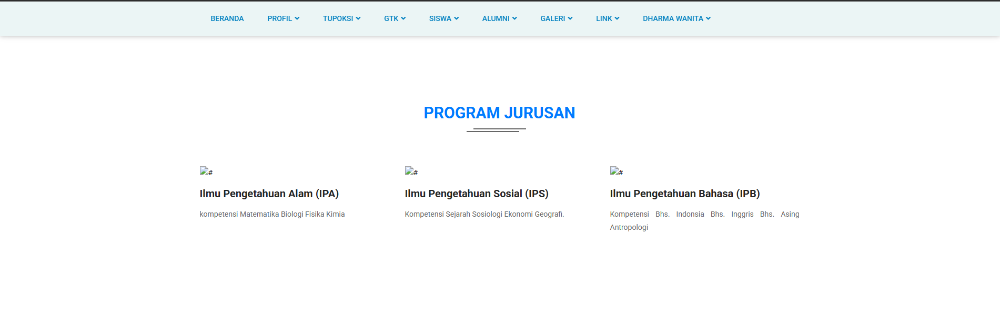
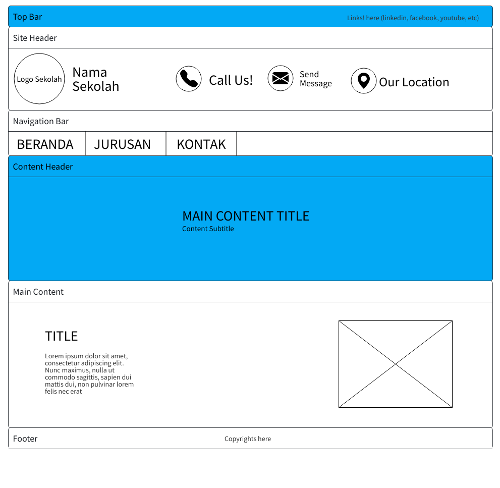

# Pemrograman-Web-B-_5025251145_Raffa-Atha-Maulana_Tugas-2

## Nama Website 
Official Website - SMA Negeri 22 Surabaya

## Sumber
[sman22sby.sch.id](sman22sby.sch.id)

## Deskripsi
- Top bar website yang berisikan informasi kontak dan link tambahan.
- Header website yang berisikan logo dan nama sekolah, informasi kontak(no. telp dan email), dan lokasi sekolah.
- Navigation bar yang berisi tombol navigasi ke laman lain sekolah.
- Main content yang berisi konten utama (beranda, jurusan, dan kontak).

## Screenshot Website
- Laman beranda, sambutan kepala sekolah, dan visi-misi.

- Laman Jurusan

## Wireframe Website

## Deployed Web Link
[websman22sby.vercel.app](https://websman22sby.vercel.app)
